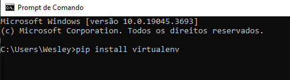
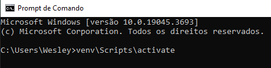
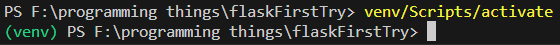
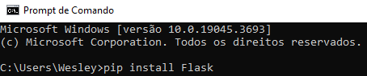
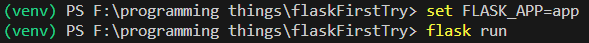
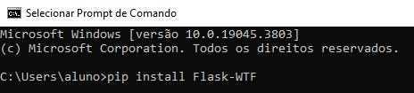
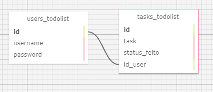

# **FORMULARIO COM FLASK**

Vamos ao passo a passo de como criar um formulario com Flask.

Primeiro vamos criar o nosso ambiente virtural e para isso primeiramente vamos instalar o pacote que cria os ambientes digitando o comando abaixo no terminal:



Feito isso, vamos criar o ambiente com o comando:

#### No Windows
python -m venv venv

#### No Linux/Mac
python3 -m venv venv

Após a criação e verificação que uma pasta chamada 'VENV' foi criada no seu projeto, vamos inicializar o ambiente com o comando:



Caso a ativação tenha sido um sucesso, seu prompt deverá ter o seguinte aspecto:


 
Após isso iremos instalar o Flask no nosso ambiente:



## **Primeira janela:**


Vamos criar um arquivo **app.py** e digitar o código abaixo:

```
from flask import Flask, render_template

app = Flask(__name__)

@app.route('/')
def ola():
    return '<p>Hello, Flask!</p>'

if __name__ == '__main__':
    app.run(debug=True)
```

Após isso vamo executar o arquivo no terminal:



---

## **FASK-WTF**

Agora vamos fazer uso de outra lib do flask, a Flask-WTF (Flask-WebForms) que facilita a criação e validação de formulários em seus aplicativos web Flask.



Além do pip, faz-se necessário importar a lib para o projeto conforme abaixo:

```
from flask_wtf import FlaskForm 
from wtforms import StringField, SubmitField, EmailField
```

---

Vamos agora tentar organizar nosso projeto criando o que camamos de Padrão de Projeto:

---

# **PADRÃO DE PROJETO MVC**

## **Model:**

- Regras de negócio
- Entidades
- Funções de consulta ao banco de dados

## **View (Renderizador de resposta)**

- HTML / CSS / Flask
- **Pasta templates** 
- Arquivos: **app.py** e **forms.py**

## **Controller**

Executa o 'meio de campo' entre os models e os views:

### Dados:
- Detentor da camada de acesso aos dados:
    - **helper.py**

### Requisições
- Executa a requizição, leva pro acesso aos dados e devolve pro view

---

## **Criando os acessos ao banco de dados:**

Estarei usando o mysql.connector para esse projeto e a instalação se dá por meio do pip:

`pip install mysql.connector`

Vamos criar primeiramente o arquivo 'conector.py' que fará parte do Controller no nosso MVC.

```
import mysql.connector

class DatabaseConnection:
    def __init__(self, config):
        self.config = config
        self.connection = None

    def __enter__(self):
        self.connection = mysql.connector.connect(**self.config)
        return self.connection

    def __exit__(self, exc_type, exc_value, traceback):
        if self.connection:
            self.connection.close()
```
Essa classe fica responsável por acessar e sair com mais segurança do nosso banco de dados.

Tambem precisamos configurar a chave de acesso ao nosso banco mysql com o dicionário abaixo:

```
config = {
    'user': 'string_do_user',
    'password': 'senha_do_user',
    'host': 'host_do_servidor', 
    'database': 'nome_do_banco',
    'port': 3306
}
```

Em seguida criaremos o nosso arquivo 'helper.py' que também fará parte do nosso Controller e terá como objetivo usar a classe anterior para conectar ao banco de dados e executar as QUERY que seram passadas posteriormente:

```
class DBHelper():
    def __init__(self):
        self.connection = None

    def execute(self, sql):
        with DatabaseConnection(config) as connection: #Necessário ao criar método enter.
            cursor = connection.cursor()
            cursor.execute(sql)
            if sql.split()[0].upper() =='SELECT':
                result = list()#ok
                for row in cursor.fetchall():
                    result.append(row)
                connection.commit()
                cursor.close()
                return result
            else:
                connection.commit()
                cursor.close()
                return None
```

Note que no método 'execute()' recebe um parâmetro 'sql' que serão as QUERYS e para usar a classe DataBaseConnection do arquivo anterior necessitamos aplicar a instrução 'with' por causa do método __ enter __.

Enfim, criamos as nossas funções no arquivo functions.py que serão parte do Models no MVC e na medida que vamos dando andamento ao projeto, criamos mais e mais funções.

Antes mesmo de começar a criar nossas funções com as QUERYS é necessário modelar nosso banco para facilitar o entendimento.

Usei o site https://sql.toad.cz que tem uma interface intuitiva e dinâmica para visualização das tabelas e suas interações:

Meu projeto usará duas tabelas, uma armazenará todos os usuários criados e outra todas as tarefas, sendo que as tarefas firaram conectadas via chave estrangeira com o id dos usuários para determinar de quem cada tarefa pertence.



Com isso em mente, vamos atualizar nosso arquivo:

```
from db.helper_controller import *

class UserToDoList:
    def __init__(self, username, password):
        self.username = username
        self.password = password
        self.task = None
            
    def createUserTable(self): #ok
        '''Cria uma tabela com TODOS os usuários da minha TO-DO 
        LIST com chave estrangeira no user e na senha.'''
        conn = DBHelper()
        sql = f"""CREATE TABLE IF NOT EXISTS users_todolist (
                id INT AUTO_INCREMENT PRIMARY KEY, 
                username VARCHAR(30) NOT NULL UNIQUE, 
                password VARCHAR(30) NOT NULL
            );"""

        try:
            conn.execute(sql)
            print(f"Table created for user {self.username}")
        except mysql.connector.Error as err:
            print(f"Error creating table for user {self.username}: {err}")
```

É muito interessante usar a orientação a objetos para manter o código organizado nessa etapa. Note que nossa classe ingesta o atributo 'self.task' como None, pois a tarefa ainda não foi determinada.


